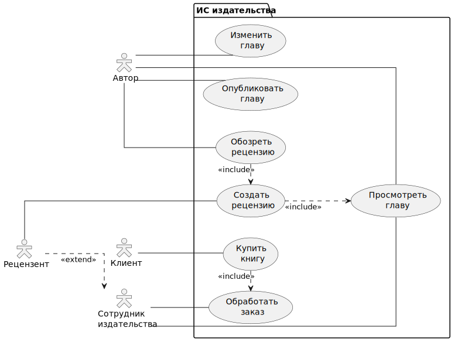

# Лабораторная работа №1  
## Тема: Формулирование требований к программной системе  
### Цель работы
    Научиться анализировать поставленную задачу, формулировать функциональные и нефункциональные требования к проектируемой системе.

---

## Перечень заинтересованных лиц (стейкхолдеров)

1. **Клиенты / Читатели**  
    Люди-покупатели книг издательства, которым нужно получить доступ к книгам и отдельным главам.

2. **Авторы**  
    Люди, обладающие правами интеллектуальной собственности на издаваемые книги. Заинтересованы в получении прибыли от сотрудничества с издательством в виде продажи книг (прибыль зависит от того, как автор и издательство договариваются, не указано).

3. **Сотрудники издательства**
    Заинтересованы в увеличении продаж книг (засчёт ускорения процесса их публикации) и в возможности эффективного выполнения обязанностей (предложения рецензий для книг, отправки физических копий книг и глав клиентам)

4. **Руководители издательства**
    Заинтересованы в сохранении конкурентоспособности компании и планировании стратегии развития бизнеса

---

## Перечень функциональных требований

### FR-1. Публикация глав
- Система должна позволять авторам публиковать отдельные главы своих книг. 
- Доступ к просмотру глав разрешён авторам данных глав и сотрудникам издательства.
- Поскольку главы относятся к книгам, система должна дать возможность авторам создавать свои книги.
- Главы могут быть в обычной версии и "бета-версии" (ранний доступ с возможностью вношения изменений автором )

### FR-2. Создание рецензии
- Система должна позволять сотрудникам издательства создавать рецензии на главы.
- Система должна поддерживать копирование и техническое редактирование

### FR-3. Обзор рецензии
- Система должна уведомлять авторов о созданных рецензиях.
- Система должна позволять авторам просматривать созданные рецензии.
- Система должна позволять авторам принять или отклонить рецензию.

### FR-4. Покупка глав
- Клиенты могут покупать главы в обычной версии и в "демо-версии"
- Система должна предоставлять клиентам список глав
- Клиент может выбрать, покупать ли главы в твёрдом переплёте либо в электронном виде

---

## Диаграмма вариантов использования

Ниже приведена даграмма вариантов использования

 

---