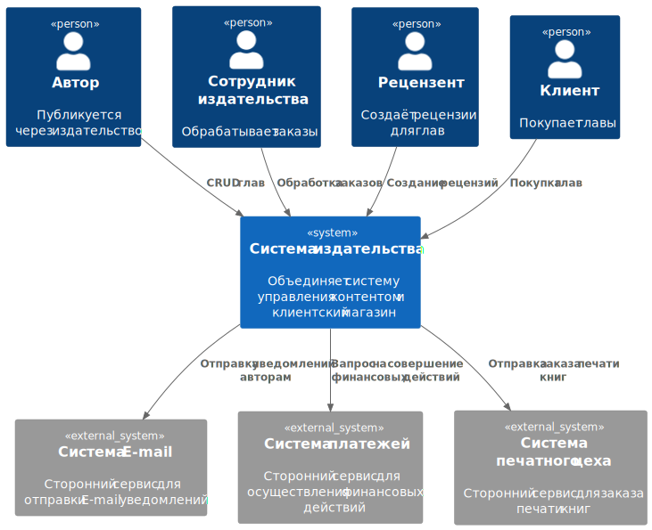
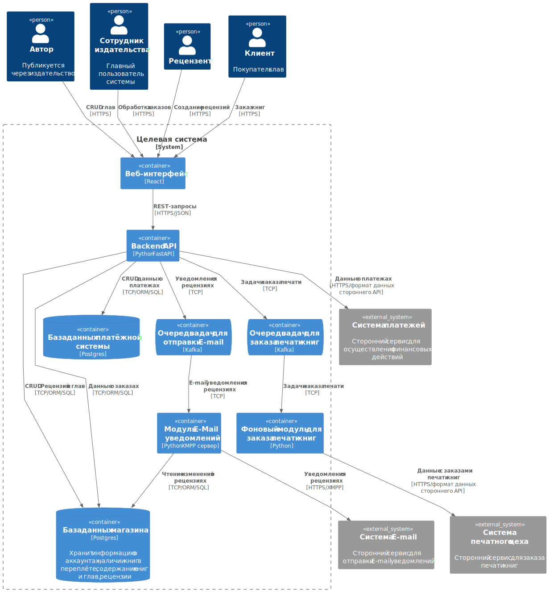
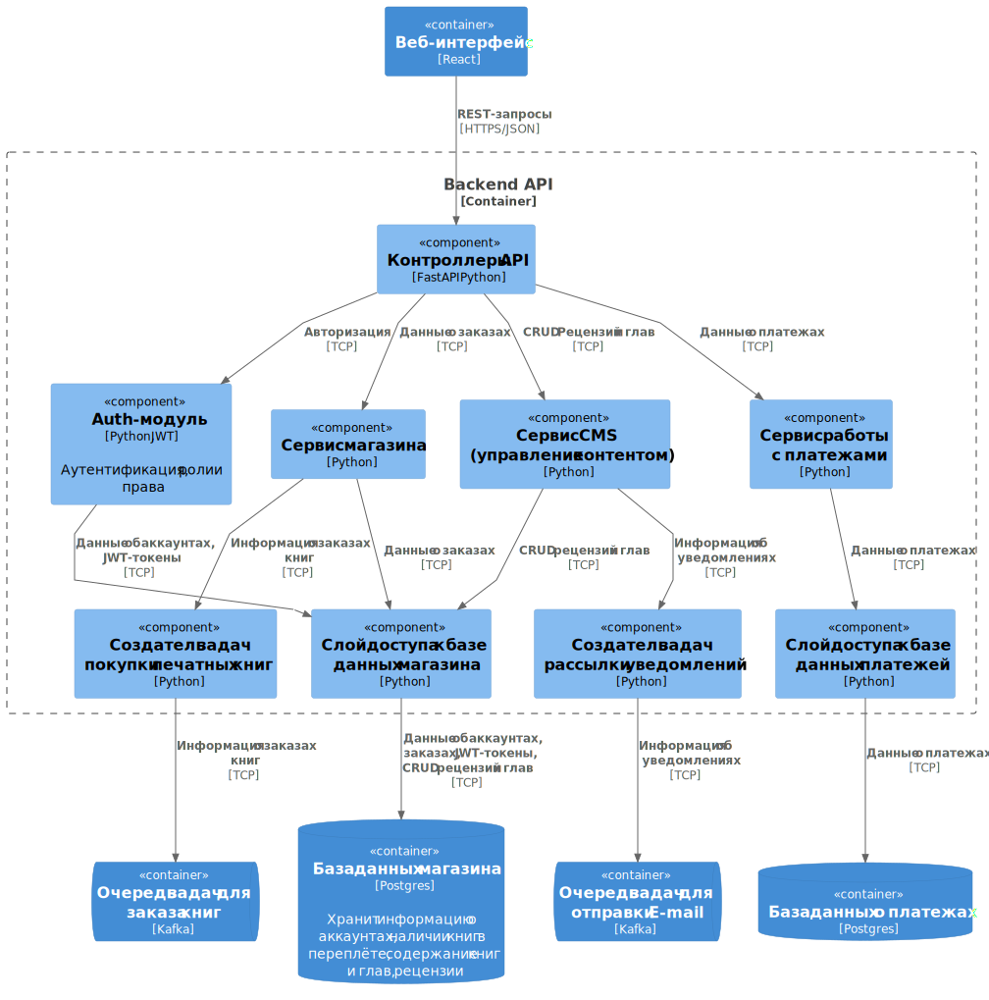

# Лабораторная работа №2  
## Использование нотации C4 model для проектирования архитектуры программной системы  

---

## Диаграмма системного контекста

Ключевые элементы диаграммы:
- Пользователи: Клиенты, Авторы, Сотрудники издательства.
- Целевая система.
- Система платежей для осуществления финансовых действий
- Сторонняя система E-mail
- Сторонняя система печатного цеха

---

## Диаграмма контейнеров

Выбран архитектурный стиль **клиент–сервер + сервисная архитектура**.  

Причины выбора:
1) Нужно **несколько модулей развертывания** и **сетевое взаимодействие**: веб-интерфейс ↔ Backend API ↔ DB; также необходимо разделить части приложения по доменам и для каждой выделить свою базу данных.
2) Простота MVP: можно начинать без сложной микросервисности, но уже иметь разделение на контейнеры.
3) Повышенная безопасность и масштабируемость по сравнению с монолитными архитектурами, что соответствует нефункциональным требованиям.

Контейнеры:
- **Веб-интерфейс** - интерфейс для просмотра, редактирования,заказа книг и обработки заказов.
- **Backend API** - бизнес-логика, пользователи, выдача результатов.
-  **Очередь задач для отправки E-Mail** - для правильной обработки задач отправки E-Mail уведомлений и обработки возможных сбоев или невыполнения задач по каким-либо причинам
-  **Очередь задач для заказа печати книг** - для правильной обработки задач оформления заказов печати книг и обработки возможных сбоев или невыполнения задач по каким-либо причинам
- **Фоновый модуль для заказа печати книг** - сервис оформления заказов печати книг в твёрдом переплёте.
- **Модуль E-Mail уведомлений** - отправляет авторам уведомления о рецензиях
- **База данных магазина (Postgres)** хранение данных о клиентах, наличии книг, и данных о заказах.
- **База данных платёжной системы (Postgres)** хранение финансовых данных о покупках/возвратах клиентов.
- **E-Mail модуль** - отправка уведомлений по E-mail как отдельный модуль.

---

## Диаграмма компонентов

### Компоненты контейнера Backend API

Показано разбиение Backend API на компоненты:
- Контроллеры API - точка входа в backend.
- Auth-модуль - логин/регистрация пользователей в системе, выдача ролей
- Сервисы (магазина, CMS, платежей) реализуют бизнес-логику по отдельным зонам ответственности.
- Слой доступа к базам данных - отделяет бизнес-логику от SQL и работы с БД.
- Создатель задач - передает фоновые операции (заказа книг, уведомлений) в очереди.